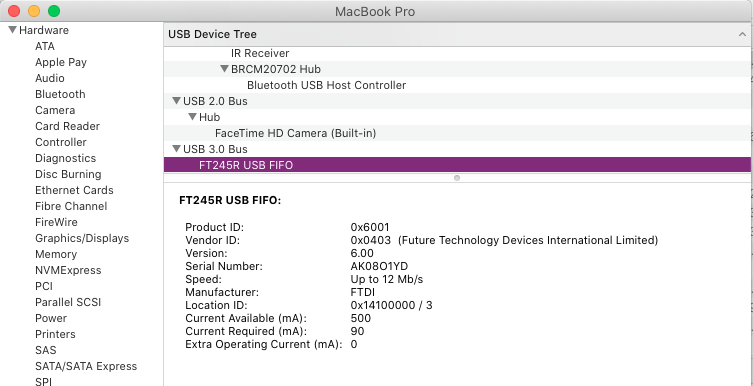

# N64 NetLib

A set of tools and libraries to connect your Nintendo 64 homebrew to the internet for multiplayer using your flashcart's USB slot.

This repository is organized as such:
* `Client App` - This is the clientside app that users will need to find a server, upload the ROM via USB to the N64, and keep tethered for the communication to work.
* `N64 Library` - A library for use with N64 homebrew that allows some basic networking functionality.
* `Examples` - Example ROM and server applications that showcase the library in action.
* `Master Server` - This is the master server application which every server will connect to. This will store a live database of known servers, allowing the clientside app to discover said servers.

### How to use

#### How to play:

##### System Requirements

Windows

    
* Windows XP or higher
    * Windows XP users should be on the latest Service Pack
* [The Windows version of this FDTI driver](https://www.ftdichip.com/Drivers/D2XX.htm). In the comments column, there is a link for a Setup Executable, which is the recommended way of installing the driver. A restart may be required. 
    * If you are on Windows XP, be sure you download the XP driver lower in the page, and not the first one.

    

Linux

    
* Ubuntu (Haven't tested with others)
* Run the included `installer_linux.sh` script to set up everything for you. If you are unable to launch the script, remember to mark it as executable.

If you do not wish to run the script, then:
* You must run NetLib Browser with `sudo`.

macOS

    

* Connect your flashcart to your computer via a Micro-USB cable. Confirm that the corresponding FTDI USB device appears in **System Information** window.
* If you grabbed a pre-built NetLib Browser binary (AKA you didn't compile it yourself from the source code), you'll have to deal with the fact that macOS prevents running unsigned binaries by default. To fix this, go to the Security & Privacy panel in the System Preferences menu and explicitly allow NetLib Browser to be run.

 

1. First, make sure you fulfill the prerequisites detailed above for your operating system.
2. Connect your flashcart to a computer that has an internet connection. 
3. Put your flashcart in a state where it's ready for USB uploading. With the EverDrive, this means the console is ON and in the menu. For the rest, your console should be off.
4. Open the NetLibBrowser application on your PC.
5. Find a server (or manually connect to one).
6. Play on your console.

#### How to host a server:

Simply launch one of the example servers. The example servers all support UPnP, if supported and enabled by your router. If it does not, you will need to [forward your ports](https://www.noip.com/support/knowledgebase/general-port-forwarding-guide). Check the [Examples folder](https://github.com/buu342/N64-NetLib/tree/main/Examples) for further READMEs.

#### How to develop:

Check [the Wiki](https://github.com/buu342/N64-NetLib/wiki).

### FAQ

**Q: What flashcarts are supported?** 
**A:** [Whatever flashcarts UNFLoader supports](https://github.com/buu342/N64-UNFLoader?tab=readme-ov-file#unfloader), as this project uses UNFLoader's libraries for USB communication.

**Q: Does this work with Morita Shogi 64 or the 64DD Modem cartridge?** 
**A:** I do not own these devices, so I have no way to write support for them. 

**Q: Do I need to register my server with the master server in order for friends to join?** 
**A:** Nope. You can manually connect to known server addresses in the browser application. You will need to have the ROM that the server is using in order to be able to join it, however.

**Q: Does the library work for LAN or P2P connections?** 
**A:** In theory, yes. I haven't tried it though, and I haven't designed the browser application for that in mind. You will need to manually connect to these servers.

**Q: Can I make this work with X retail game?** 
**A:** If you have the source code for said game, sure. But even then, such a thing would require a massive rewrite of the game's engine, as it very likely wasn't designed with networking in mind. In real life, game networking is *much more complex than just "sending a player's controller input over the wire"*. See [this article](https://developer.valvesoftware.com/wiki/Source_Multiplayer_Networking) for more information.

**Q: I found a potential security flaw** 
**A:** If you think the issue is severe, please reach out privately by email first. Otherwise, open an [issue](issues). Pull requests are also welcome and super appreciated!

**Q: How can I get my ROM uploaded to the official master server?** 
**A:** Get in touch! Create a post in the [discussions](discussions) page (ideal) or send me an email.

### Security

This project aims to keep the system extensible (IE anyone can make their own custom server for people to connect to), but safe to use. To ensure this, the following restrictions are in place:
* The official Client App will only download ROMs directly from the master server. This ensures that only vetted ROMs are allowed, and prevents piracy via distribution of modified commercial ROMs. Support for patches is not currently planned by me, but can be added in a PR.
* The official Client App only serves as a packet distributor, and will not handle most UNFLoader packets outside of debug prints.

Of course, I share no responsibility for the use of unofficial Client Apps. 

One minor flaw currently present in the server code is that there is no ban system in place, so there is currently no way to ignore clients who keep unecessarily pinging the server. This is a minor thing (considering how niche of a project this is) and I intend to fix it in the future.

### Credits

* Huge thanks to Zandronum developers (Specifically robikz and Kaminsky) for answering some questions I had about their implementation
* Also extending my thanks over to BigBass, networkfusion, s4sy, and Magstriker for helping me test this over the internet
* Command_tab for squatting the domains used for the master server + samples
